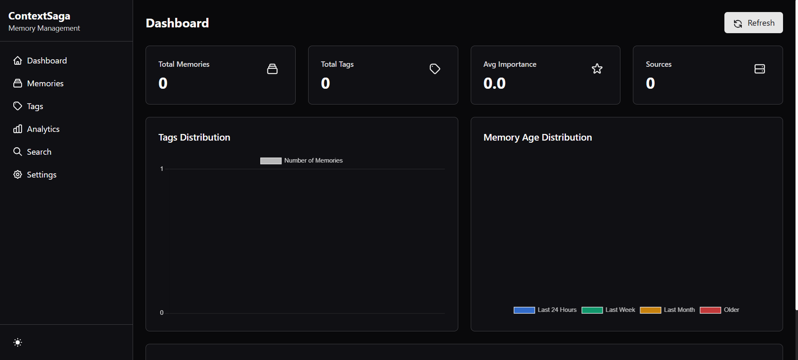

# ContextSaga

An AI-powered memory management system that processes content through semantic search and uses LLMs for CRUD operations on a knowledge database.




## Features

- Process text content through AI agents for memory management
- Split large texts into manageable chunks with token-based processing
- Resume processing from checkpoints if interrupted
- Rich formatted display for tables and progress tracking
- Easy-to-use command-line interface

## Installation

```bash
# Clone the repository
git clone https://github.com/TheDivyanshShukla/beta-context-saga.git
cd beta-context-saga

# Create and activate a virtual environment (optional but recommended)
python -m venv .venv
# On Windows
.venv\Scripts\activate
# On macOS/Linux
source .venv/bin/activate

# Install the package and dependencies
pip install -e .
# Or with development dependencies
pip install -e ".[dev]"
```

## Usage

### Command-Line Interface

ContextSaga provides a command-line interface for easy interaction:

```bash
# Process a file
python -m beta_context_saga.cli process --file path/to/file.txt

# Process text
python -m beta_context_saga.cli process --text "Your text content here"

# Search memories
python -m beta_context_saga.cli search "your search query"

# List memories
python -m beta_context_saga.cli list

# Delete a memory
python -m beta_context_saga.cli delete memory_id

# Start the dashboard
python -m beta_context_saga.dashboard

# Update configuration
python -m beta_context_saga.cli config --memory-db path/to/memory.db --chroma-db path/to/chroma

# Show current configuration
python -m beta_context_saga.cli config --show
```

### Web Dashboard

ContextSaga includes a web-based dashboard for managing your memories visually:

```bash
# Start the dashboard with default settings
python -m beta_context_saga.dashboard

# Or customize settings using command-line arguments
python -m beta_context_saga.dashboard --host localhost --port 8080 --debug
```

The dashboard provides:
- Memory management interface
- Tag browsing and management
- Semantic search capabilities
- Analytics and visualization
- Configuration settings

### Dashboard Configuration

You can configure the dashboard using the web interface or command-line:

1. **Web Interface**: Navigate to `/settings` in the dashboard
2. **Command Line**: Use the config command
   ```bash
   python -m beta_context_saga.cli config --memory-db data/custom_memory.db --chroma-db data/custom_chroma
   ```
3. **Configuration File**: Edit `~/.context_saga/config.json` directly

Settings include:
- `memory_db_path`: Path to the SQLite database file
- `chroma_db_path`: Path to the Chroma vector database directory
- `host`: Server host address (default: 0.0.0.0)
- `port`: Server port (default: 5000)
- `debug`: Enable/disable debug mode

### Rich Display Features

The application uses Rich to provide:

- Formatted tables for memory items
- Progress bars for chunk processing
- Nicely formatted search results
- Statistics on processing operations

### Python API

```python
from beta_context_saga.core import ContextSaga
from beta_context_saga.rich_display import display_processing_stats

# Initialize ContextSaga
saga = ContextSaga()

# Process a file
results = saga.process_file("path/to/file.txt")

# Display results
display_processing_stats(results)
```

## Configuration

You can customize the token limits and overlap settings in `core.py`:

```python
# Initialize with custom settings
saga = ContextSaga(
    max_tokens_per_chunk=24000,  # Max tokens per chunk
    token_overlap=100,           # Token overlap between chunks
    checkpoint_dir="custom_checkpoints"  # Directory for checkpoints
)
```

## License

[MIT License](LICENSE)